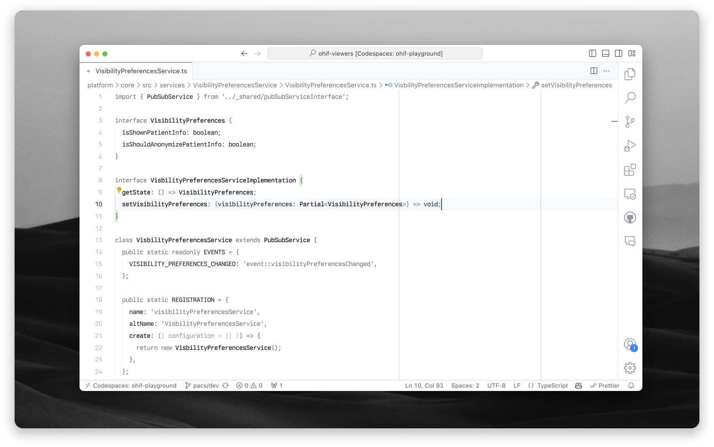

<h1 align="center">Onion Monochrome Theme for VS Code</h1>

## Install

[Onion Monochrome Theme](https://marketplace.visualstudio.com/items?itemName=rknguyen.vscode-onion-monochrome-theme) is available on Marketplace.

## Thanks

Onion Monochrome Theme is a combination of Github Light (Classic) and Lambda
Studio Whiteout with _chotto_ modifications.

- [Github Theme](https://marketplace.visualstudio.com/items?itemName=GitHub.github-vscode-theme)
- [Lambda Studio Themes](https://marketplace.visualstudio.com/items?itemName=LambdaStudio.lambda-studio-themes)
